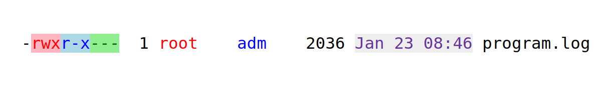

# Berechtigungen

- Jede Datei besitzt eine Berechtigung, wer was mit der Datei machen darf

Um die Berechtigung einzulesen kann man folgenden Befehl verwenden:

```bash
ls -l  NOTE.md
```

Output:

```bash
-rw-r--r--@ 1 sdwillbrand  staff  92 Mar 13 11:17 NOTE.md
```



## sudo

Manche Ausführung benötigen die Berechtigungen eines Super Users. Hier wird der `sudo` Befehl benutzt, um gewisse Aktionen als Super User auszuführen. Dieser ist für einen kurzen Zeitraum aktiv.

Bsp.: Installieren von Software aus dem Internet

## Packages

Mittels `apt` (Advanced Package Tool) lassen sich Programme aus dem Internet installieren.
Dafür wird die Berechtigung eines Super Users benötigt.

Bsp:
`sudo apt install tree`

### Installieren von .deb Dateien

`sudo dpkg -install installationsdatei.deb`
