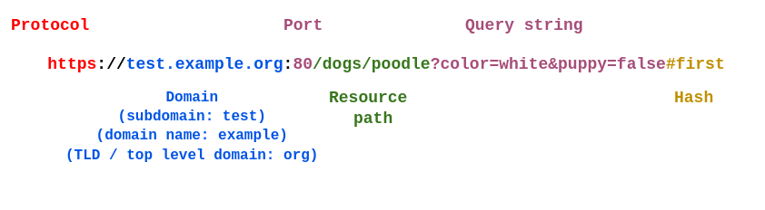

# Internet- und Netzwerkkonzepte

## Anatomy von URLs

- URL = Uniform Resource Locator
  - Unterform der URI (Uniform Resource Identifier)
  - Eindeutige Internetadresse

## HTTP, HTTPS

- HTTP = Hypertext Transfer Protocol
  - Definiert den Datenaustausch im Internet
- HTTPS = Hypertext Transfer Protocol **Secure**
  - Verschlüsselte Version des Datenaustausches

## IP-Adresse

- IPv4, 8-Byte-Adressierung
- Ipv6, 16-Byte-Adressierung

## DNS

- Telefonbuch für Domainnamen, um sich keine Telefonnummern zu merken
